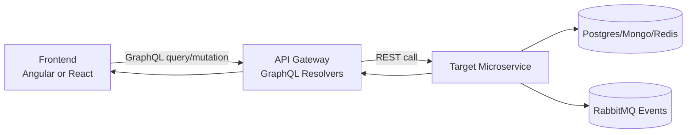
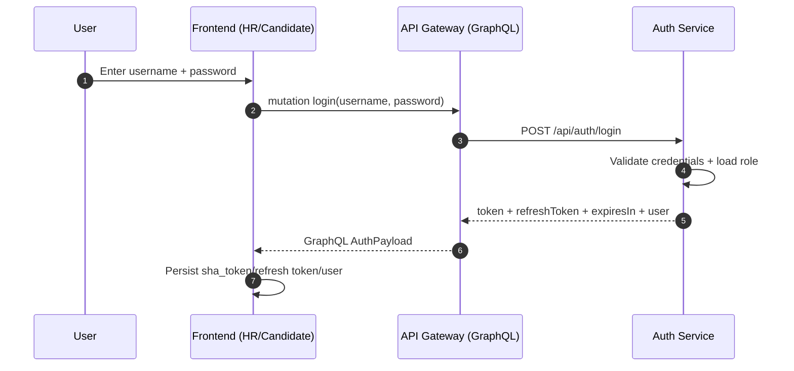
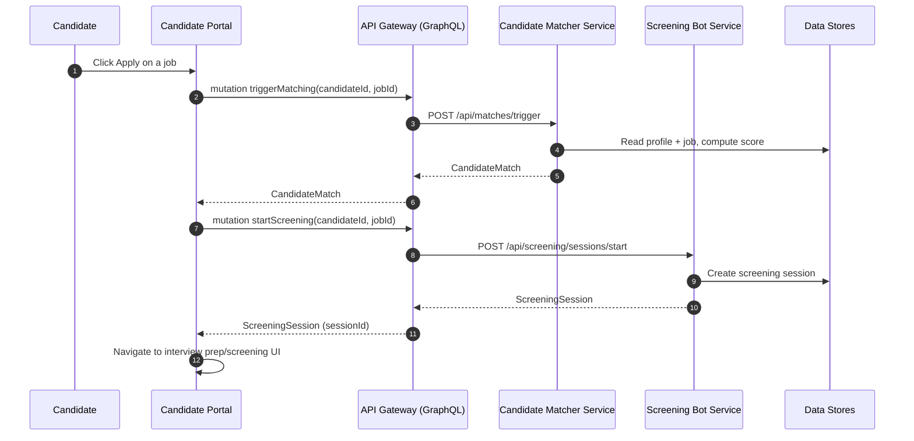
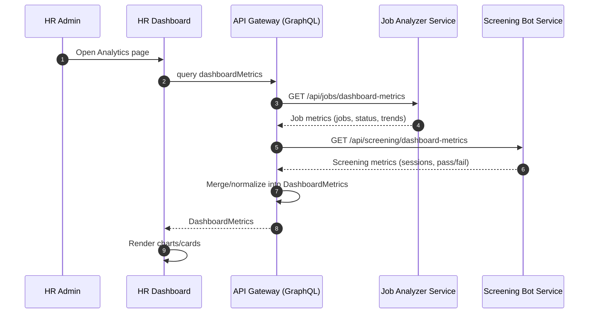

# Smart Hiring Assistant: Architecture Flow (One-Page)

## Stack at a Glance

- **Frontends**: Angular HR Admin (`:4200`), React Candidate Portal (`:5173`)
- **Edge/BFF**: GraphQL API Gateway (`services/api-gateway`, `:8000`)
- **Auth**: `services/auth-service` (`:8001`) with JWT + OAuth2
- **Domain services**: resume parser (`:8002`), candidate matcher (`:8003`), interview prep (`:8004`), job analyzer (`:8005`), screening bot (`:8006`), notification (`:8007`)
- **Data/infra**: PostgreSQL, MongoDB, Redis, RabbitMQ
- **Observability**: Prometheus, Grafana, Elasticsearch, Kibana, Jaeger

## Core Request Pattern

- Gateway normalizes/aggregates backend responses into frontend-friendly GraphQL shapes.
- JWT is validated once at the edge, then propagated for downstream authorization context.

---

## Sequence 1: Login (Credentials)

**Why this path**
- Single auth implementation (`auth-service`) avoids duplicate auth logic in each frontend/service.
- Gateway keeps frontend contract stable even if auth-service payload evolves.

---

## Sequence 2: Apply Job (Candidate Flow)

**Why split matching and screening**
- Matching and screening scale independently.
- Teams can tune scoring logic without touching conversational screening workflows.

---

## Sequence 3: HR Analytics Dashboard

**Why through gateway instead of direct calls**
- Frontend makes one request, gateway orchestrates many.
- Reduced frontend coupling to microservice endpoints and payload formats.

---

## Why This Architecture Works

- **Gateway as BFF**: fewer frontend round-trips, cleaner contracts.
- **Microservice boundaries**: each domain capability evolves independently.
- **Async-ready**: RabbitMQ decouples slow/non-blocking processes.
- **Polyglot data fit**: relational + document + cache where each makes sense.
- **Operability**: metrics, logs, and traces support production debugging.
